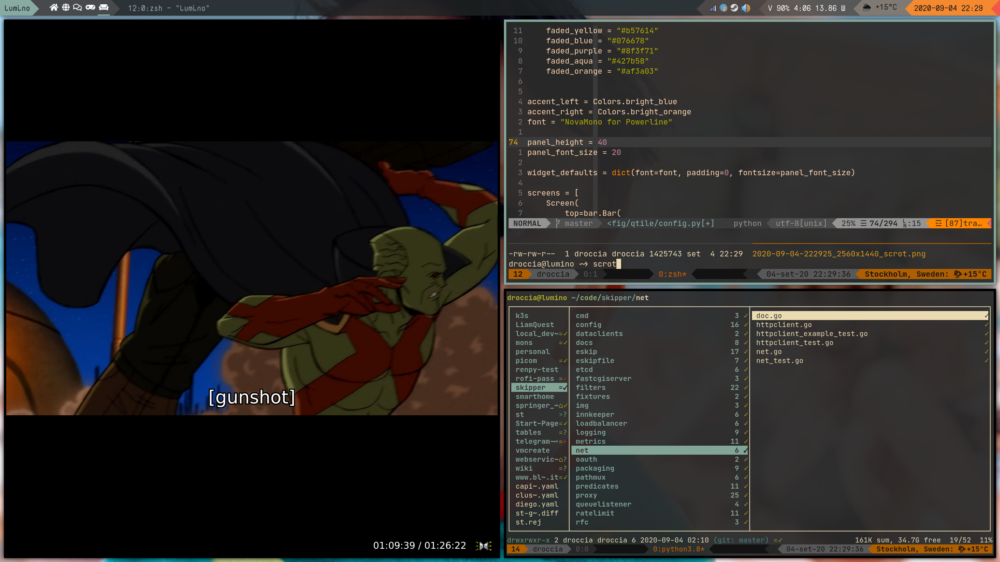

# Qtile powerlite theme

This is a Qtile configuration with a Powerline look and feel for the panel

## Why?

* Powerline can be heavy at times
* One less daemon to run
* Why not

## Requirements

* Qtile
* a font supporting Powerline glyphs. I tested it with
  * monofur
  * Roboto Mono
  * Source Code Pro
  * NovaMono
